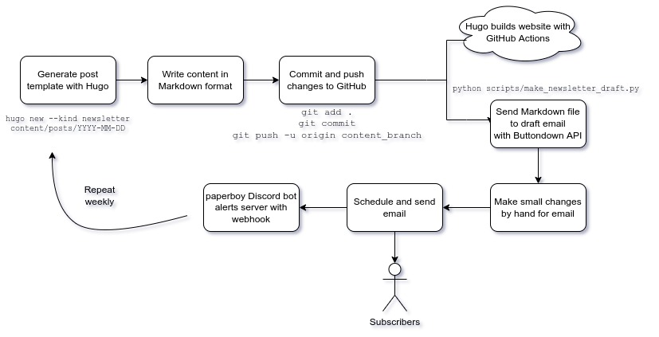

# Until It's Not Fun: A Weekly Newsletter
This is an open source website for our newsletter [Until It's Not Fun](https://untilitsnotfun.com), written by Jacob McLane and [Westley Winks](https://westleywinks.com). We are just a couple of friends that wanted to build a newsletter for ourselves, with no expectations other than having fun. [Subscribe here](https://buttondown.email/untilitsnotfun) to get our emails or [click here](https://untilitsnotfun.com/posts) to see our past posts.

# Usage
Like our website and workflow and want to use it to start your own project? Easy!

First, you need to install Hugo. Look at [the documentation](https://gohugo.io/getting-started/installing/) to do that. Then clone it to your machine with:

```
git clone https://github.com/Westley-Winks/until-its-not-fun-newsletter.git <folder_name>

cd <folder_name>
```
Then go crazy and have fun changing everything! See what your site looks like by running `hugo server` and going to `http://localhost:1313` in your browser. It is already optimized for deploying on GitHub as it will automatically build whenever a push is made to `main`.

We use [Buttondown](https://buttondown.email/?utm_campaign=untilitsnotfun&utm_affiliate=affiliate) to distribute emails. There is a script (`scripts/make_newsletter_draft.py`) that uses Buttondown's API to generate a draft. It uses the title of the index file as the subject, the content as the body, and a custom header that links to the post on our website. Run the script with environment variable `INPUT_POST_PATH` that is equal to the folder path of the post you want to draft (e.g. `INPUT_POST_PATH=2022-04-15`). Then go make sure it is formatted correctly in your Buttondown drafts and hit send!

## Workflow



# Contributing
If you have any feedback on either the site or the newsletter content itself, [open an issue!](https://github.com/Westley-Winks/until-its-not-fun-newsletter/issues) If you have questions about anything or want to reach out to us you can either [open a discussion](https://github.com/Westley-Winks/until-its-not-fun-newsletter/discussions) or (even better!) [subscribe to the newsletter](https://buttondown.email/untilitsnotfun) and hit reply. We would be happy to hear from anyone!
# License
The content of this project itself is licensed under the [Creative Commons Attribution 3.0 Unported license](https://creativecommons.org/licenses/by/3.0/), and the underlying source code used to format and display that content is licensed under the MIT license.