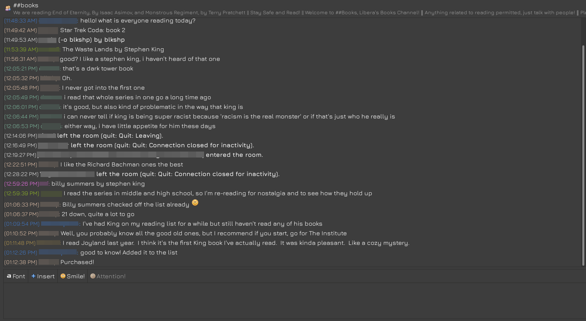

## Popcorn and A Coke
### *Where Jacob talks movies*
...

...

...

## The Tech Shelf
### *Where Westley talks about IRC*

/join #untilitsnotfun

/nick dadofapollo

*(12:04:08)* **Westley is now known as dadofapollo**

*(12:05:16 PM)* dadofapollo: IRC (Internet Relay Chat) is a beautiful relic of the internet that helped set the stage for how we communicate on the internet today. IRC was one of the first internet based chat systems. Users can enter different chat rooms called channels and can start communicating with anyone else that is in the same channel. People can connect from anywhere in the world with internet access so you have no idea who you are talking to or where they are from. You only know their username (known as a "nick") and whatever they share in the channel. There is a certain element of anonymity where people can truly be themselves without fear of being judged for what they look like, what they do, or anything else. It leads to truly organic and wholesome conversation between complete strangers.

*(12:13:52 PM)* dadofapollo: Back when IRC was first created (in the 1980's), it required programming knowledge to get connected and was used at universities because they were the only places that had computers and internet before they were mainstream consumer products. As more and more households got connected to the internet, IRC was what people used to communicate with one another. Then as the internet evolved and platforms like Facebook and Discord came online, people stopped wanting to connect with strangers on the internet and used these social platforms to connect only with people they knew in real life. IRC usage has been declining from millions of users in the early 2000's to only tens of thousands today.

*(12:35:56 PM)* dadofapollo: The interface looks familiar and old *in a good way*. It is a line-based interface so each message exists on one line. Here is what a typical exchange looks like (with nicks blurred out):

*(12:36:28 PM)* dadofapollo: There are no fancy profile pictures, gifs, pictures, or emojis - it is simply a space for conversation.

*(1:01:44 PM)* dadofapollo: I have truly enjoyed dabbling in IRC channels recently. I was introduced to this internet antique by Gretchen McCulloch in her book Because Internet. I like having IRC open when I am doing light work on my computer or relaxing at night before bed. It's like having your dorm room door open for anyone to come in and talk but without any of the awkwardness or wondering if they will ever leave or worrying about them inviting you to a party when all you want to do is sit at home and do lame stuff like read a book. As McCulloch puts it, IRC channels are a fantastic "third place": the hallway at a conference, an informal club meet-up, a car show, where people come together under similar interests and have organic conversation more powerful than their more polished counterparts like speeches or work meetings.

*(1:19:42 PM)* dadofapollo: My absolute favorite channel I have found is ##books on the Libera server. On a normal day, there are only about 50 people in the channel, making it feel more cozy and personal. People talk about what they are reading, their opinions about those books and authors, and anything else book related. In my real life social circle, I don't really have anyone to talk about books with because I have a small circle and it takes time to get through a book. In ##books, there is a constant stream of 50 people talking about books I probably wouldn't have even heard of otherwise.

*(1:28:18 PM)* dadofapollo: I am going to continue talking in these IRC spaces until it completely dies off. I hope to develop new relationships with these people completely through this simple text-based exchange network. I want to recognize  their nicks and associate them with good conversation. Most importantly, I hope people in the future will say about me "Oh there's dadofapollo! I have no idea where he is or what he looks like but I do know that he has a good heart and that he is my friend."

/quit see you next week

*(1:30:22 PM)* **dadofapollo has left the room (quit: see you next week)**

## What We Like This Week:
- &#x1F4D6; **Book:**
- &#x1F3A6; **Movie:**
- &#x1F4FC; **Video:** This cover of Maniac by Michael Sembello performed by Pomplamoose.  I love this group. They ooze passion. Wait until the end of the video and listen to them get all giddy with excitement when the song is over. *-Westley*
- &#x1F3A7; **Song:** More Pomplamoose. Cover of Grace Kelly by Mika ft. Grace Kelly.Grace Kelly is the saxophonist in the cover and absolutely kills it. *-Westley*
- &#x1F4F0; **Article:**