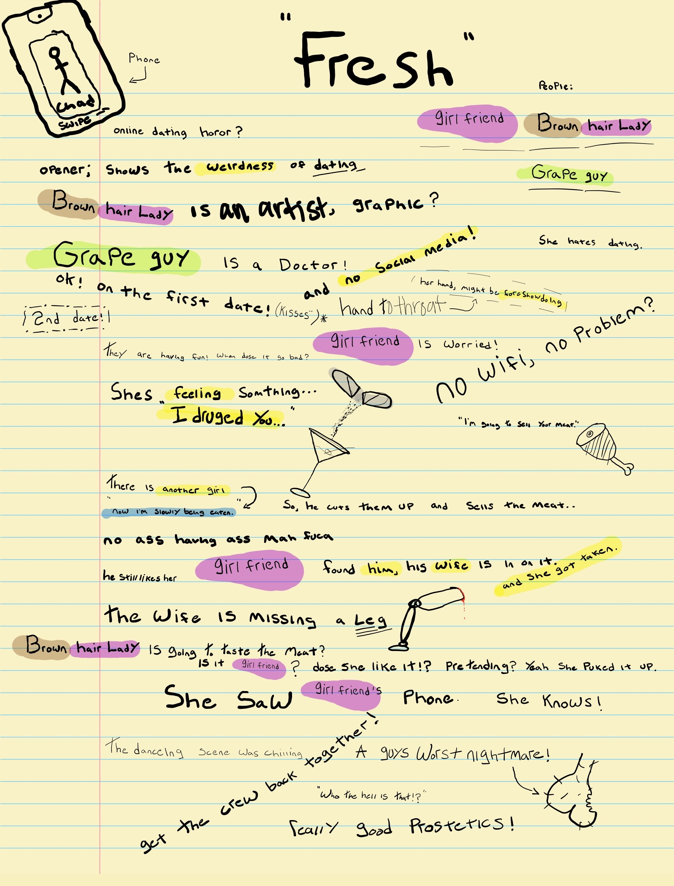

## Popcorn and A Coke
##### *Where Jacob talks movies*

### Fresh 2022

Daisy Edgar-Jones  (Main)

Sebastian Stan (Main)

I can’t tell if this movie is a horror, suspenseful, maybe a romance? But it’s nothing like I’ve seen before!
I started watching this with very little insight on the story, so I was on the ride through the whole thing. To me personally, it’s not a movie I’m going to re-watched 5 times like others, but I did enjoy it.

I’m not going to spoil the twists, so here is a brief over view of the story.

We follow a young woman, in the dating scene. She is on the verge of giving up on the whole idea when she meets a guy that sparks hope in this desert of “good guys.” We follow her on the beginnings of what seems to be a very promising relationship. But that takes a turn.

If you’re looking for a good movie to watch with a friend that will definitely make your skin crawl (if it doesn’t, we need to talk), then this is a good pick!

\*Spoiler Warning\*

<button type="button"
        onclick="show()"
        id="show-notes">
        Show Notes
</button>



## The Tech Shelf
##### *Where Westley talks about Discord Bots*

In January 2022, I built my first Discord bot. It was very crudely put together and completely unreliable. Jacob wanted a bot in the server that would randomly insult our friends during the day. Put simply, he wanted a bot that was mildly an asshole. On that weekday in Powell Butte, Complibot was born.

I threw together Complibot v0 in a few hours using Python and a couple tutorials. Simplicity and fun was the goal at that point. Since I am very comfortable with Python, I opted to use a third party package, discord.py, that wraps Discord's API's which are normally used with Javascript. The goal was to have Complibot send a random insult or compliment (I didn't want her to be too mean) to someone twice a day, at random times.

She was completely unpredictable. I couldn't get the randomness and time (we didn't want her pinging us in the middle of the night) to work with the asynchronous nature of the Python functions. I converted it to use commands like `/insult` and `/compliment` to trigger it or whenever she was mentioned. This worked fine except for the weighting between her picking an insult or a compliment. On average, she should have sent one compliment for every insult; all of her responses were insults. To this day, I have no idea why the weighting wasn't 50/50.

Not only that, the channel members were static; I handwrote everyone's member ID into a `.txt` file and she picked from that randomly. Every time someone joined the server, I would have to edit that `.txt` file to put the new member in the pool to be selected. The code was embarrassingly bad but, hey, it worked and made my friends laugh.

The deployment was even worse. I deployed Complibot on Heroku where she listened and was running 24/7. Because I was too cheap to get out of Heroku's free tier, Heroku limited the time to about three weeks per month. Complibot didn't even work for the last week of the month.

Why am I talking about a failed bot I built months ago? Two reasons:

1. I released a newly developed and much, *much* better version, Complibot v1

2. I recently applied for a job at Discord so I have been thinking about bots lately

For Complibot v1, I completely rebuilt it from the ground up. In most of Discord's guides and resources, they use Javascript. Any time is a good time to learn a new programming language! In one weekend, I had a bot that works every time, is deployed much more reliably, and is open source. I came out with Javascript knowledge and continuous deployment knowledge.

Discord's getting started guide helped immensely. I took most of Complibot's parts and pieces from their demo project. Complibot now has full support for slash commands. When you start typing a Complibot command, Discord shows the description of what the command does and also prompts the user what to put in after the command.

I am most excited about the deployment. Complibot now lives on Google Cloud Platform's Cloud Run. Cloud Run is a serverless platform that runs apps. Because it is serverless, Complibot isn't constantly running and increasing my bill. It goes to sleep after 300 seconds of inactivity and wakes back up whenever someone sends her a command. She only takes about three seconds to wake up and send a response. Cloud Run also connects nicely with Cloud Build. Cloud Build is configured to trigger a build whenever there is a push to the main codebase on Complibot's GitHub repo. This makes my life so much easier and I am able to make changes on the fly. When I push changes to share my code on GitHub, those changes are automatically reflected in the Discord channel within minutes thanks to GCP.

Using this same process, I ~~am working on~~ built a bot that sends a message to Discord whenever this newsletter gets sent out each week. You might be thinking, "Why? Isn't that exactly what an email does? Subscribers will get a message in their emails whenever this newsletter gets sent out."

That is exactly right. But learning is fun, so why *not*?

Keep learning.

I leave you with some Complibot samples:
```md
/compliment: You’re great at figuring stuff out.

/insult: If I typed ‘stupid’ in google, your name would pop up.
```
Ouch.

I have the honor to be Your Obedient Servant,

Westley

## What We Like This Week:
- &#x1F4D6; **Book:** Project Hail Mary by Andy Weir. What a journey. If you liked *The Martian* by Weir, you are guaranteed to enjoy both the similarities and differences with this one. *- Westley*
- &#x1F4AC; **Video:** This playlist. I've been watching through this Youtube playlist, about a charity motorcycle ride across Australia, and it makes me want to grab all my friends and take off on Monkey bikes! *- Jacob*
- &#x1F3AE; **Game:** Redactle.Now that the Wordle hype has died down, here's a Wordle spin-off! Every day, a Wikipedia article is redacted. Guess words to fill it in until you can guess the title of the Wikipedia article. (HT <em>The Morning Brew</em>) *- Westley*