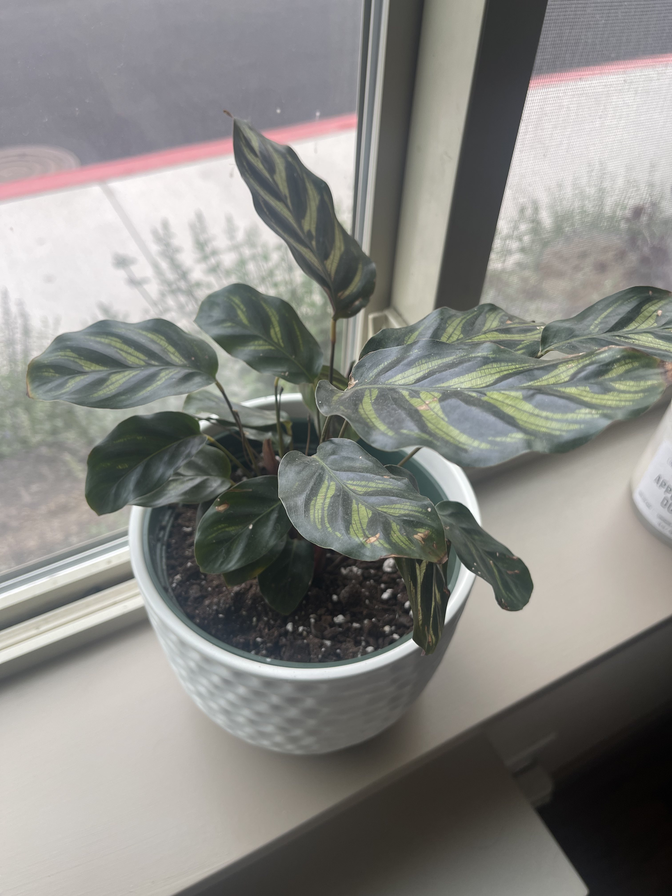
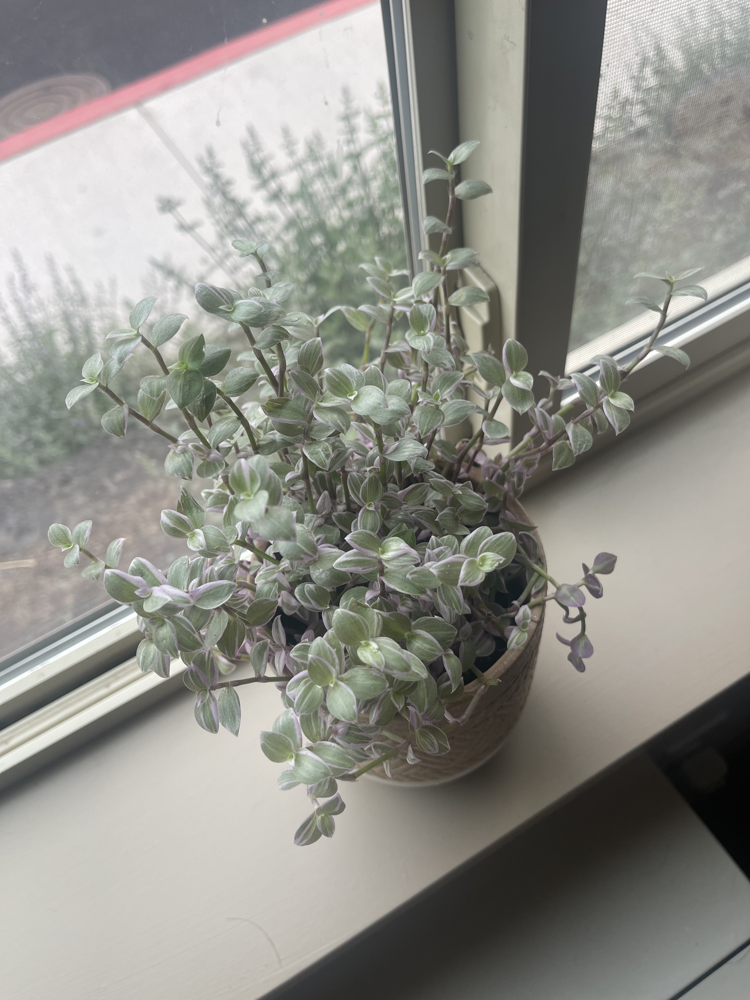
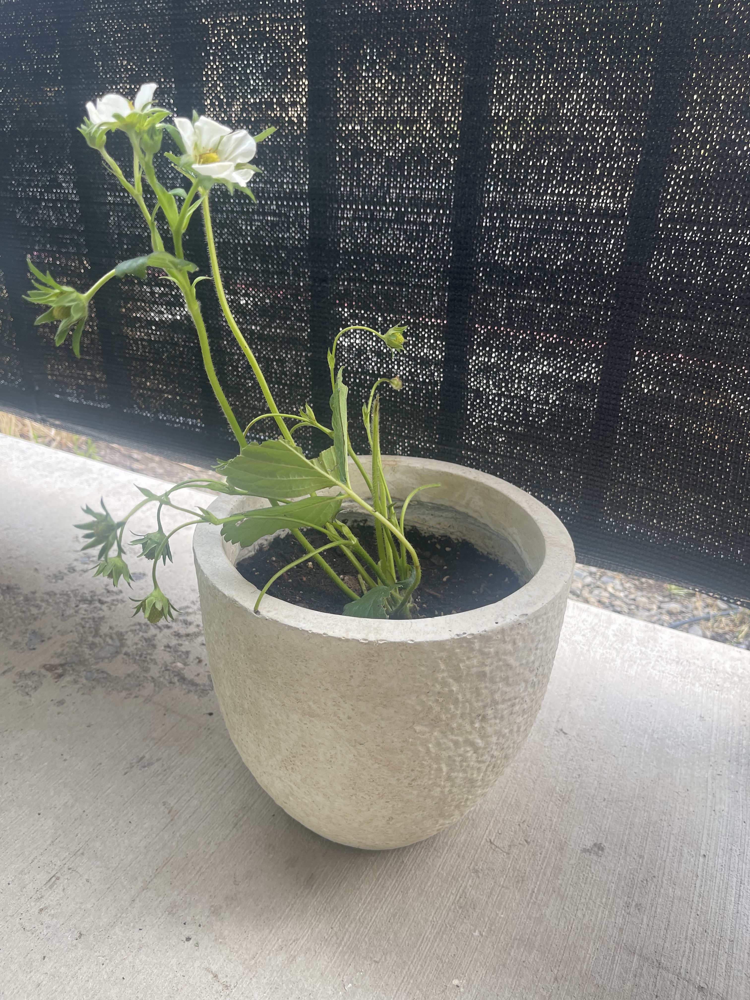

---

## Popcorn and A Coke
### *Where Jacob talks movies*

From Jacob: “Hello to our thousands of readers, I apologize but I haven’t had time to really sit down and analyze a film lately, I thought about whipping something together, but decided that isn’t what this is for anyway. Tune in next week I think I’ve got a banger in store!”

---

## The Tech Shelf
### *Where Westley talks about Proton*

I have been using Proton Mail for a few months now instead of using GMail. Proton offers secure, encrypted email that gets locked up in a such a way that only you and the recipient see the message.

What does this mean? When you send an email from your GMail account, it gets stored on Google's servers as plain text. This means that anyone that can access the servers can see all of your emails; when they were sent, who they were sent to, and the actual message content. Authorities can also request the records from Google and give Google a gag order to prevent anyone from knowing they accessed them.

Encrypted email offers a "solution". Before being sent, your email gets encrypted, jumbled into an unreadable mess. Even if Proton wanted to see your message (or anyone else for that matter), they physically can't. They are stored with zero-access encryption on Proton's servers. I put "solution" in quotes because this is a classic case of the Network Effect. The more people that use Proton, the better it is for everyone.

Let's say I sent a message from my Proton Mail to a GMail user. That message still makes its way to Google servers where they have the keys to access the message (you can, however, use password protection to have a weaker form of encryption). The real magic happens when I send an email to another Proton user. Since both the recipient and the sender put the message on Proton servers where there is zero-access encryption, that email is end-to-end encrypted: *only* the sender and recipient can see the message.

How does this encryption happen physically? Proton uses **public key encryption**. Each person generates two keys; a public key and a private key. Keys are long (usually 2048 bits) strings of characters and an encryption algorithm uses these to quickly lock or unlock the message. The basic concept is that anything locked with a *public* key can only be unlocked with the matching *private* key.

If I wanted to send you an end-to-end encrypted email, I would write my email and look up *your* public key. I would then lock my message with it. The only way for anyone to de-scramble that message is with your private key which only you have. To reply, you would encrypt your message with my public key that can only be unlocked with my private key. Proton does this all automatically and it is exactly like using any other email service but with excellent protection in the background.

Encryption and cryptography is a massive field and this is just the most basic idea.

Proton also offers a fantastic VPN service. With a VPN, all of your internet traffic gets routed to a different server so it looks like your traffic is coming from somewhere else. The most relevant benefit for this is that it hides your internet activity from your internet service provider (Starlink, Bend Broadband, etc.) to prevent them from selling your internet history data.

The trick is that you have to trust your VPN service to not do the exact same thing. Proton VPN has been audited by a third party and can prove that they don't keep logs of your internet traffic. Your internet activity gets routed through Proton servers and then they *burn that data* (virtually, of course).

I barely scratched the surface of why Proton offers a fantastic service and I didn't even get into their mission and why people should pay for this service to support Proton's mission. Proton just got a huge update with a re-branding and a simplified pricing structure. Privacy focused companies usually stall out after a certain amount of growth simply because people generally don't care about their online privacy. This is a huge step in the internet privacy space and it is exciting to see a solid company with a strong mission grow into an actual competitor to the more mainstream companies.

Next up we have a special guest, Mary McLane! Good with her words and quick on her feet, Mary is a dear friend of mine.

I have the honor to be Your Obedient Servant,

Westley

---

## Girlboss
### *Where Mary (girl and boss) talks about whatever girl bosses of the world may be up to!*

Guest column 1: Plant mom?

First of all, thank you to Jacob and Westley for allowing me to be a guest writer on their newsletter! As a longtime ‘Until It’s Not Fun’ fan, this really is a dream come true. 

I’m beginning writing on Monday morning, so I thought I could talk about one thing I was up to this past weekend - which is becoming a plant mom!

I visited a nursery in town with Holly and Lydia, and while I was planning on just tagging along (and taking advantage of the Starbucks trip) I became really inspired while seeing all of the different plants at the nursery. 

I think it’s important to touch on the fact that I have very, very little experience in plant care. In fact, I’ve only ever “kept alive” one plant before, and quite honestly, it’s not doing that well… But, there’s no time like the girlboss present to learn something new!

I picked up two plants at the nursery, along with two pots. I took advice from Lydia and simply set the nursery planters into the pots I purchased, which helps protect from root rot. Eventually, I may decide to fully transplant (see what I did there?) the plants into their respective pot homes with potting soil. But for now, I’m going to play it safe and let them continue to thrive in their nursery housing! 

The first plant I was drawn to is a leafy specimen. The nursery donned this plant as “Calathea Makoyana“ , however I felt the name Lola was more fitting! You can see a photo of Lola in her new pot home below.

The second plant that caught my eye is a more petite girl, called “Callisia, Pink Panther” via the nursery. Although, since this plant stood out to me because of its purple coloring, I decided to go with Lila! (Full name: Lilac) Check out a photo of Lila hanging out in her pot home below!

Now, I could’ve stopped there. But what part of girlboss screams “STOP WHILE YOU’RE AHEAD!” ?! We headed to Wilco to grab some vegetable starters. While there, I spied a strawberry plant starter.. and as a strawberry lover, I just had to! So I grabbed a strawberry plant starter, and another pot. 

This is a slightly different adventure, as this will be an outdoor girl, as opposed to Lola and Lila, who are inside girls. It’s also a slightly different adventure because I transplanted (haha!) the strawberry plant into some potting soil! It was fun to get my hands dirty in the soil, and pack my strawberry plant away in her new home. 

Check out a photo of Halle (short for Halle Berry) below!

So, that has been my most recent adventure in girlboss-ing! I’m really excited, as I’ve always really admired people who can care for such tender, vulnerable life that is plant life. I have a lot to learn, and it’s going to be a really fun journey!

Thanks again for allowing me to be a part of this edition of ‘Until It’s Not Fun’! 

xoxo,  
Mary

---

## What We Like This Week:
- &#x1F4D6; **Book:** The Maid by Nita Prose. This book was a super fun read! It’s lighthearted and heartwarming, with a touch of mystery and thrill. I gave it 5 stars! *-Mary*
- &#x1F4AC; **Video:** Santa Barbara performed by Pomplamoose and Benny Sings At this point, I should just have a section titled **This week's Pomplamoose video**. It is just too good to not share. *-Westley*
- &#x1F4F2; **App:** Blossom. “Blossom” app is helping me learn more about my plants! It also send out reminders for when they need to be watered. *-Mary*