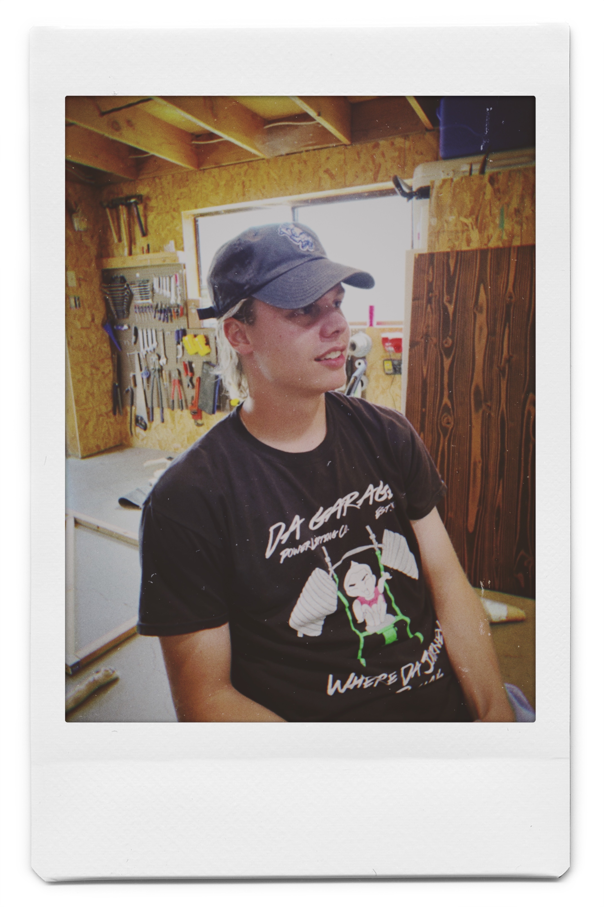

---

## The Tech Shelf
### *Where Westley talks about this week*

With much to do and much to celebrate this past week, this post is going to be a short one and not a wonderful piece of art like all of my previous posts. I don't have much of a muse for a topic to write about this week so instead let's go over the highlights my week:

**Tuesday:** I got my last clearance for the Peace Corps! This was the big win for the week. It is looking more official. Barring something crazy happening, I am going to be a Youth Development Specialist in Morocco set to depart in September. I will be gone for a total of two years plus three months, educating the youth of Morocco. I am working on a much longer piece to describe my motivations and expectations for this next chapter of my life so stay tuned for that.

**Wednesday:** Wednesday night I went to the new brewery in town and had a beer with friends I haven't seen in a while. It was very fun and so great to see them to reconnect. Everyone is moving in a great direction in life and it is important to me to not get so enthralled in my path that I lose track of that.

**Thurday:** I started the day off finishing the last stage of helping some family move. My friend Bailey took advantage of an afternoon deal at the golf course and booked a tee time that same afternoon. By the combined numbers: 

- 10 beers consumed
- 25 balls lost in the water, the weeds, or the fairway of a different hole
- 2 balls ran over with a golf cart
- 3 putt average once on the green
- 11 over par...for each 9
- 4 hours to complete the course

**Friday (today!):** First, I am going to push this post to the website and schedule the email. After that, friends are coming over. With no particular agenda, we are going to enjoy the day and each other's company. Jacob is waiting in the shop, his cooler and coozies ready.

I have the honor to be Your Obedient Servant,

Westley

---

## Popcorn and A Coke
### *Where Jacob talks movies*

**Jacob:** Hello. Today I'm interviewing Callum Craig on his experience moving to Bend, Oregon from Portland, Oregon. I wanted to get his first impressions for being here. What was it, how long now? 

**Callum:** About half a month. 

**Jacob:** Callum, how has the half a month changed you?

**Callum:** It hasn't really been a change. It's been more of a, almost like a coming home. I would say the family feel between living in Portland and living in Bend is very different.  
Instead of having friends I have family, instead of having nights out, I have day projects.  
It's been an enjoyable time. I'm glad I made this decision and this is all that I wished it would be.

**Jacob:** That is fantastic. I look forward to seeing what the future holds for Callum Craig.

Thank you for your time,

Jacob

---

## What We Like This Week:
- &#x1F3A7; **Song:** Tony Revolori by Logic. *-Westley*
- &#x1F4AC; **Video:** Marble Machine. This guy made a hand powered machine to drop marbles on various instruments and makes an absolutely beautiful and unique song. *-Westley*